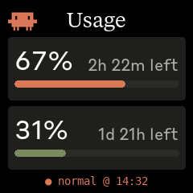

# claude-meter

Host-side daemon that fetches Claude API usage data and pushes a rendered image to a [GeekMagic SmallTV-Ultra](https://github.com/GeekMagicClock/smalltv-ultra).



No firmware flashing required — the display runs its own webserver and the daemon uploads a fresh JPEG every 60 seconds.

## Display setup

On the SmallTV-Ultra:

1. **Settings** → select the **Photo album** theme
2. **Pictures** → disable **Image auto display**

## How it works

1. Reads the Claude Code OAuth token from `~/.claude/.credentials.json`
2. Calls the Anthropic API and extracts rate-limit headers (5h session + 7d weekly utilization)
3. Renders a 240×240 JPEG with two usage panels and a status line
4. `POST multipart/form-data` → `http://<host>/doUpload?dir=/image/`
5. `GET http://<host>/set?img=usage.jpg` to display the uploaded file
6. Sleeps 60s and repeats

## Setup

```bash
pip install -r requirements.txt
```

Edit `DISPLAY_HOST` at the top of `claude-meter.py` to match your display's IP address.

## Run

```bash
python3 claude-meter.py
```

To run as a background service, use your system's process manager (systemd, launchd, etc.) or simply `nohup python3 claude-meter.py &`.

## Configuration

Only one value needs to be changed:

| Variable | Default | Description |
|---|---|---|
| `DISPLAY_HOST` | `192.168.2.233` | IP address of the display |
| `POLL_INTERVAL` | `60` | Seconds between refreshes |
| `W = H` | `240` | Display resolution |

## Dependencies

- `Pillow >= 8.2.0` — image rendering
- `requests` — HTTP uploads and API calls
- Font and logo assets from `./assets/` (part of this repo)

## Display protocol

The daemon expects the display to expose two endpoints:

- `POST /doUpload?dir=/image/` — multipart file upload (`field: file`, `filename: usage.jpg`)
- `GET /set?img=usage.jpg` — instruct the display to show the uploaded file

Tested with a 240×240 display running a compatible HTTP firmware. The daemon tolerates truncated HTTP responses from the upload endpoint (`ChunkedEncodingError`) and silent `/set` calls (`Timeout`), both of which are normal on embedded webservers.
